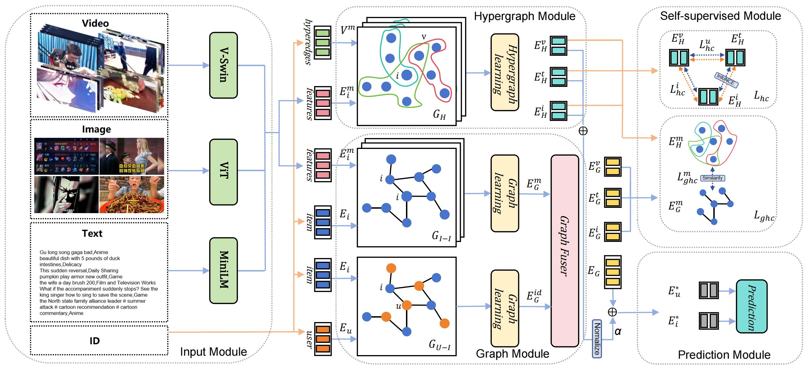
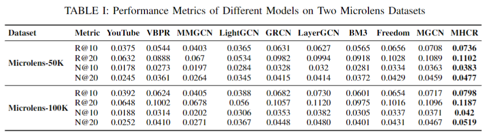

# MHCR


## Introduction

This is the Pytorch implementation for our  paper:



## Enviroment Requirement
- PyTorch 2.0.0

- Python 3.8(ubuntu20.04)

- Cuda 11.8

  

## Dataset

Processed datasets: microlens

## Training

1.   ```
     cd ./src
     python main.py
     ```

2. Run directly using main.ipynb

## Performance Comparison



